# 🧪 PerfectLab Studio — photoshoot prompt builder for ComfyUI


[](https://github.com/perfectmodelslab/ComfyUI-PerfectLab/releases)
[](https://t.me/PerfectJohny)

One node, one panel. Pick the person, the outfit, the place, the light and the camera from libraries with photo previews. The node composes the prompt, sizes and seeds. One button sends the whole session into your graph.

<p align="center">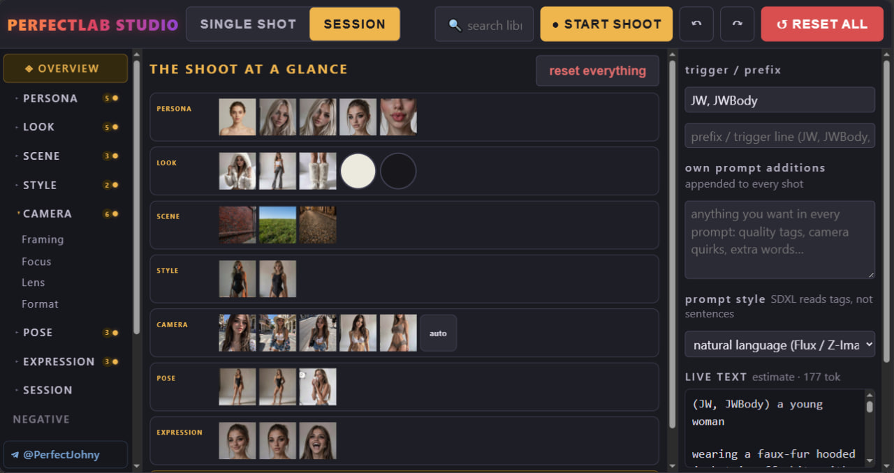</p>

## 🚀 Quick start

1. Install the node (see [Install](#-install)).
2. Open the bundled workflow: [workflows/perfectlab_base_workflow.json](workflows/perfectlab_base_workflow.json) — wired end to end with a demo shoot already picked.
3. Change the model names in the three loader nodes to yours.
4. Press **● START SHOOT** in the panel header.

<p align="center">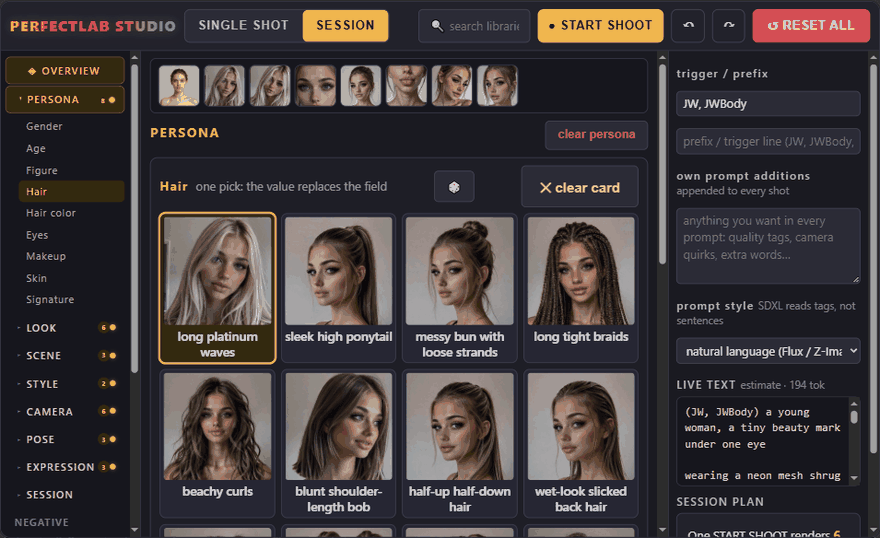</p>

## 📸 What a shoot looks like

Six looks, six scenes, six grades — each frame picks its own outfit, location, light, pose and expression from the libraries.

<table><tr>
<td>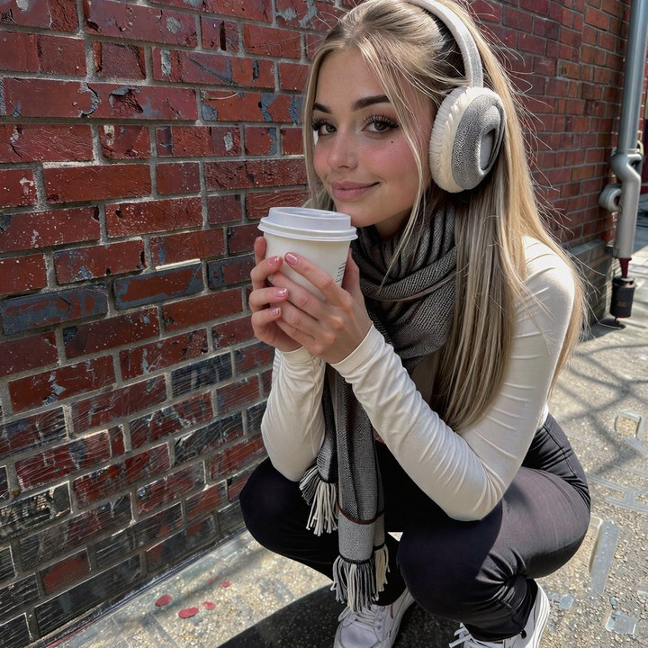<br><b>Winter Coffee</b></td>
<td>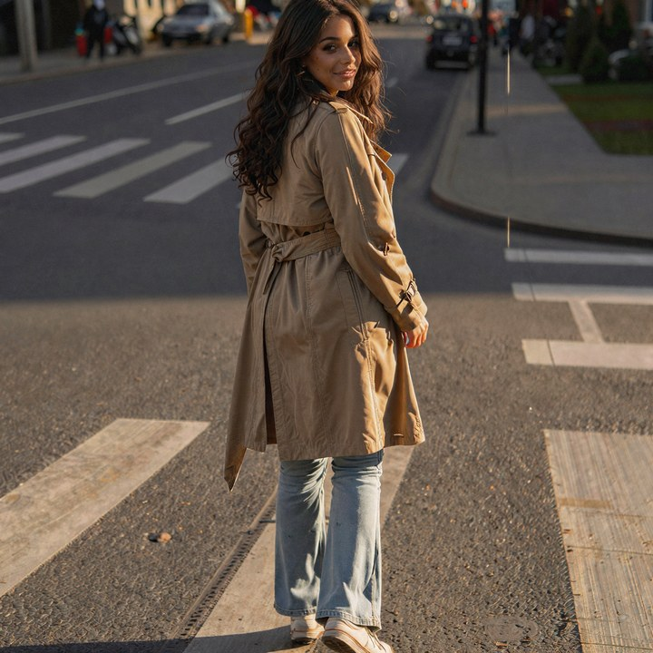<br><b>City Crosswalk</b></td>
<td>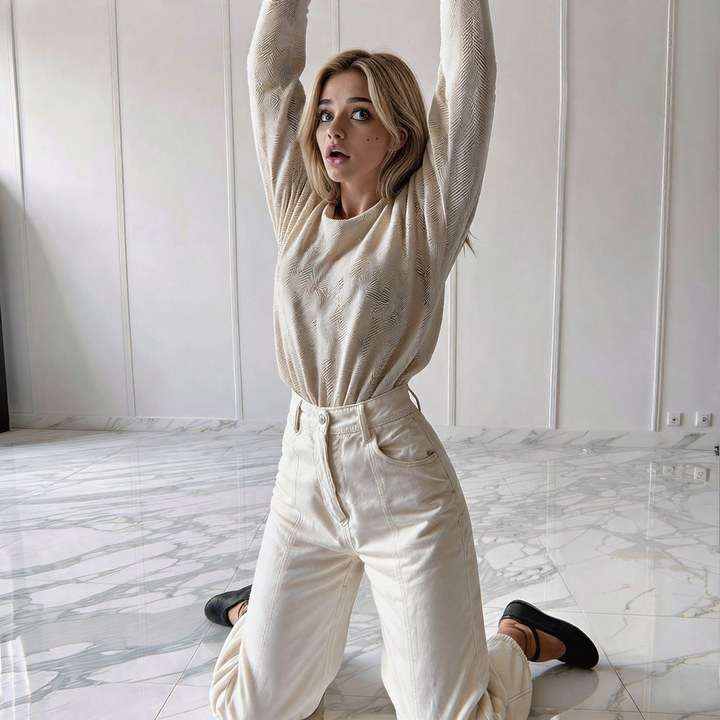<br><b>Marble Studio</b></td>
</tr><tr>
<td>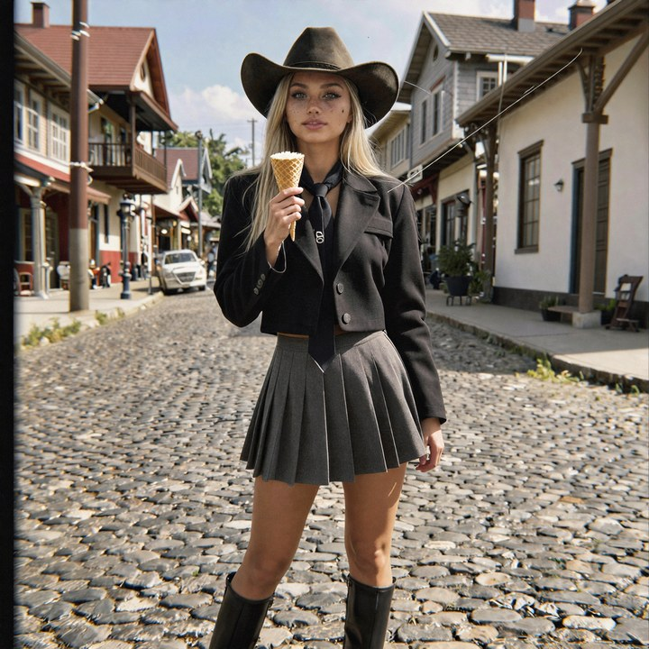<br><b>Preppy Street</b></td>
<td>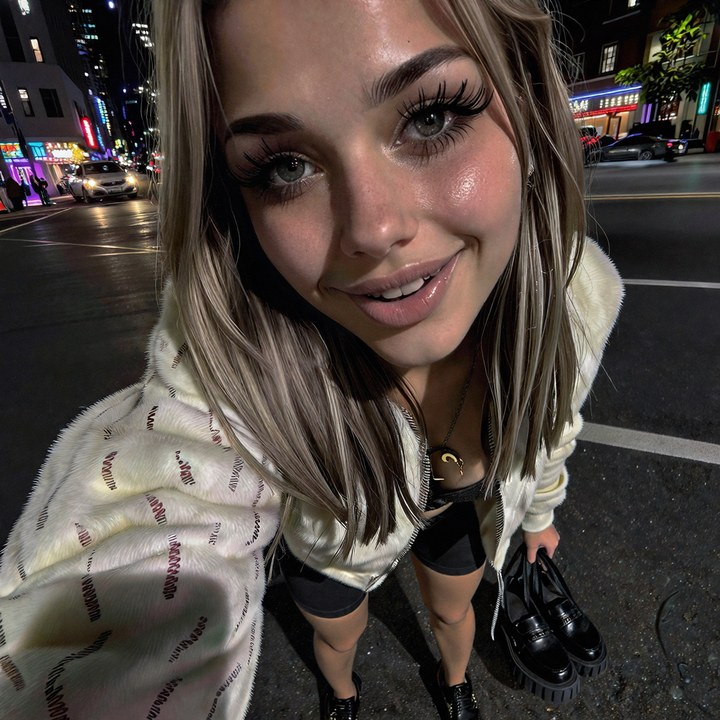<br><b>Night Selfie</b></td>
<td>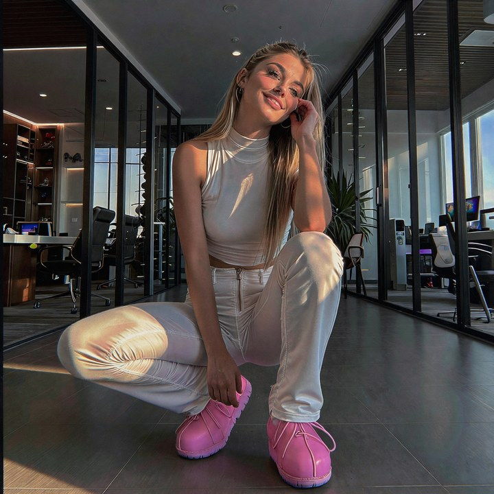<br><b>Moon Boots</b></td>
</tr></table>

The picks behind every frame — garments, colors, materials, location, light, grade, pose, expression — show on the overview wall:

<p align="center">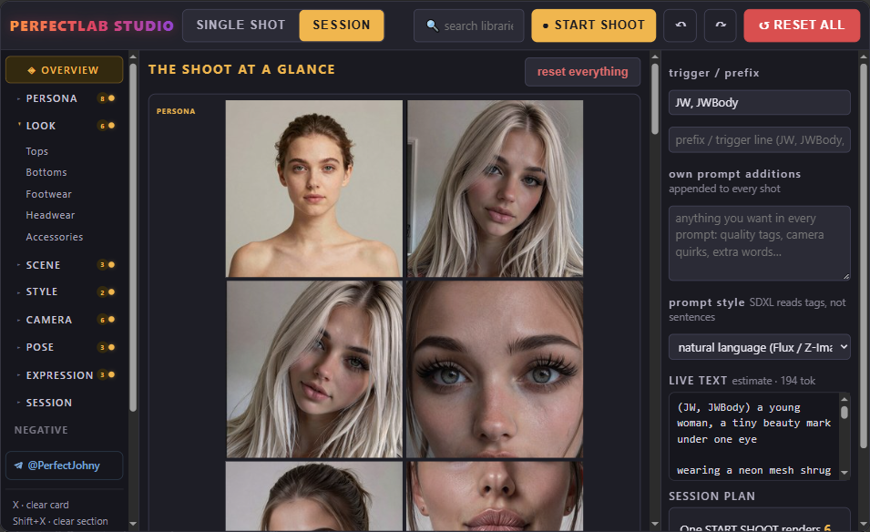</p>

## ◈ Overview

One row per section: every tile that section has picked. Click a row label to jump into that section. The sticky bar at the top of any card keeps the current picks visible while you scroll.

## 👤 Persona

Eight fields, each combining into the persona text.

### 💇 Hair

24 styles from platinum waves to a pixie cut. Each tile shows the hairstyle on the same face.

<p align="center">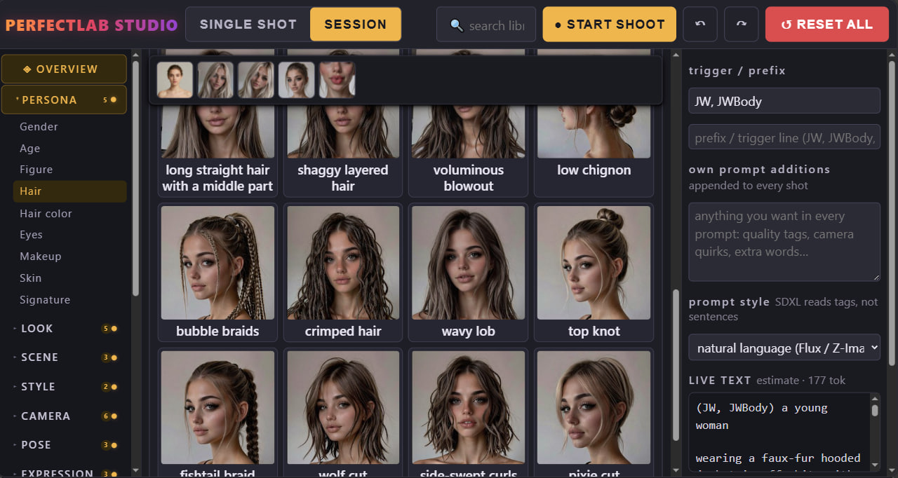</p>

### 🎨 Hair color

14 saturated carriers — the same pose, the same seed, only the tone changes.

<p align="center">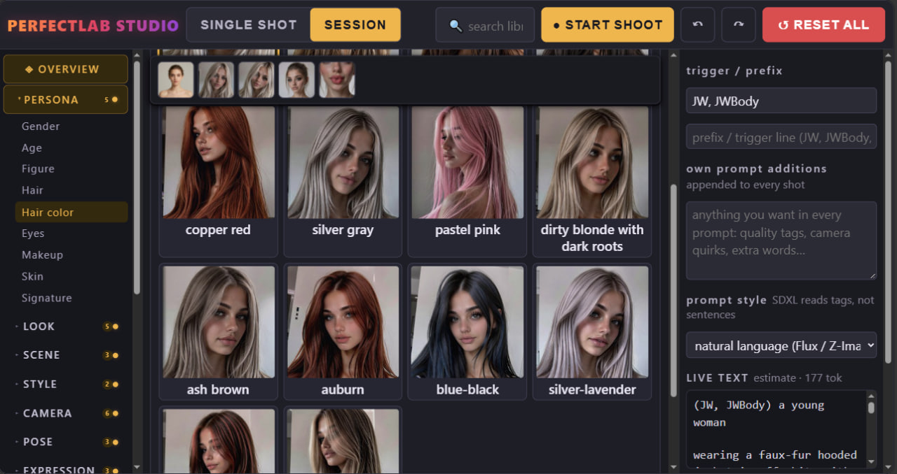</p>

### 💄 Makeup

23 tiles in three zones: nine eye looks (extreme macro on the eyes), ten lip looks (one closed mouth each), three blush tiles, and a bare face. The tiles are sorted by zone.

<p align="center"></p>

### Other persona fields

- **Gender** — 5 options (young/mature woman, young/mature man, androgynous), tiles without the cast LoRA
- **Age** — 5 presets from 18 to ageless
- **Figure** — 26 keys: ten whole-figure builds (very slim to plus-size, petite to tall) + sixteen body-part keys (large/small bust, wide/narrow hips, thin/muscular arms, broad shoulders, wasp waist, broad back, long/muscular legs, narrow shoulders)
- **Eyes** — 10 colors with a heterochromia tile
- **Skin** — 8 tones, one seed and one pose across the whole set
- **Signature** — 12 details (beauty marks, nose ring, scar, glasses, tattoos, dimple, eyebrow slit, signet ring), multi-pick

## 👗 Look

26 tops, 19 bottoms, 18 footwear, 13 headwear, 28 accessories. Each garment takes a color from photo swatches and a material from 22 fabric textures. Both go into the prompt: *wearing silk cropped tank top in champagne gold*.

### 👕 Tops

Click a tile to pick the garment, click again to clear.

<p align="center">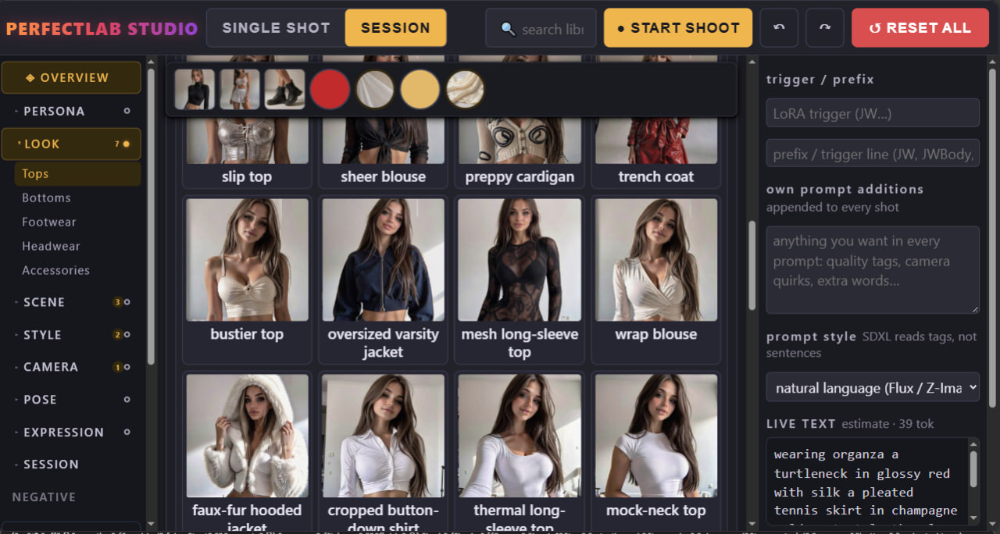</p>

### 🧵 Materials

22 fabric textures from cotton to organza. Each material chip shows the fabric close-up. The LIBRARY row keeps pieces you typed before, with their preview tiles — 📷 attach a photo, 🎬 shoot one through your graph.

<p align="center">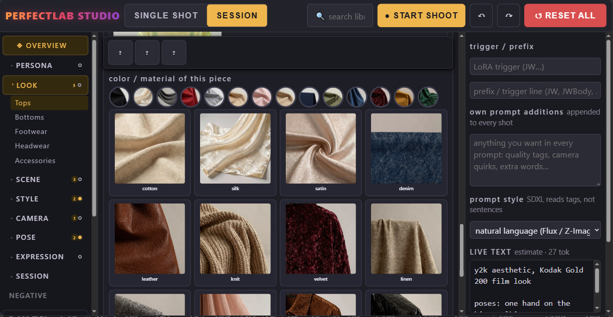</p>

### 🧢 Headwear

13 pieces with their own color picker (14 colors).

<p align="center">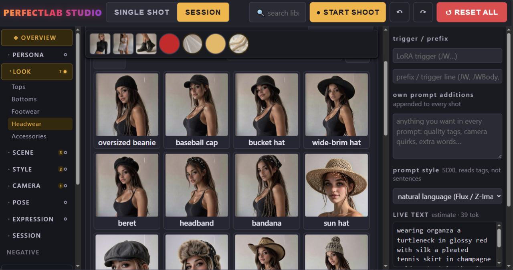</p>

### Other look fields

- **Bottoms** — 19 options: skirts, jeans, pants, shorts, dresses
- **Footwear** — 18 options with 12 shoe colors
- **Accessories** — 28 pieces, 8 jewelry metals, combine into the look

## 🌍 Scene

23 locations, 10 weather conditions, 19 light setups. Scene tiles show the place, no model in frame.

### Locations

23 places from a neon-lit arcade to a minimalist marble studio, from a rooftop pool to a red brick alley. Tiles show the place, no model in frame.

<p align="center">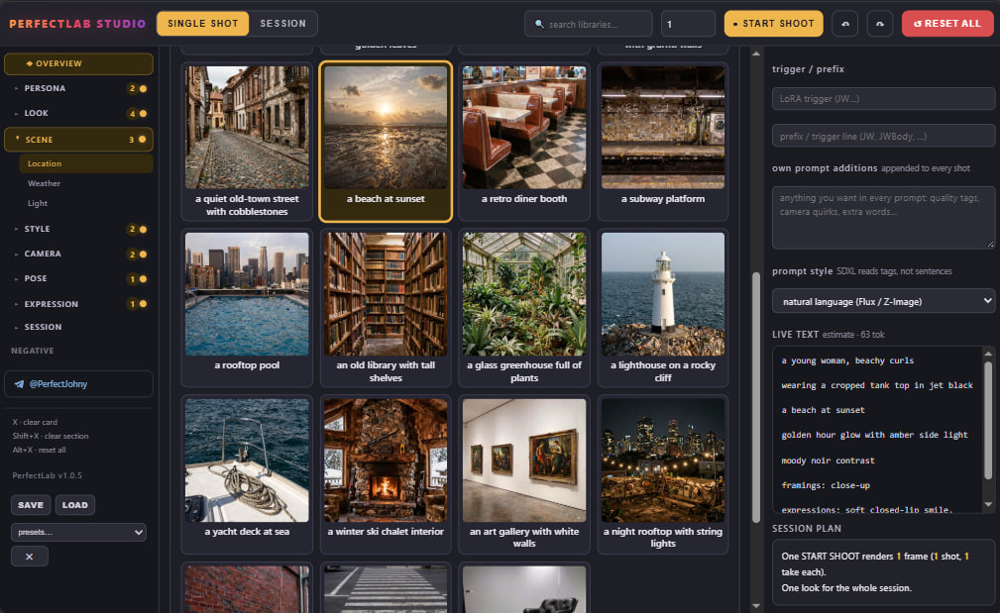</p>

### Light

19 setups: eight clock phases (dawn to neon night), four classic patterns (butterfly, rim, split, backlit silhouette — shown on a mannequin head), and six artificial sources with the lamp visible: street lamp, neon sign, candlelight, car headlights, fluorescent office, workshop lamp. Or set any hour 0–24 on the clock.

<p align="center">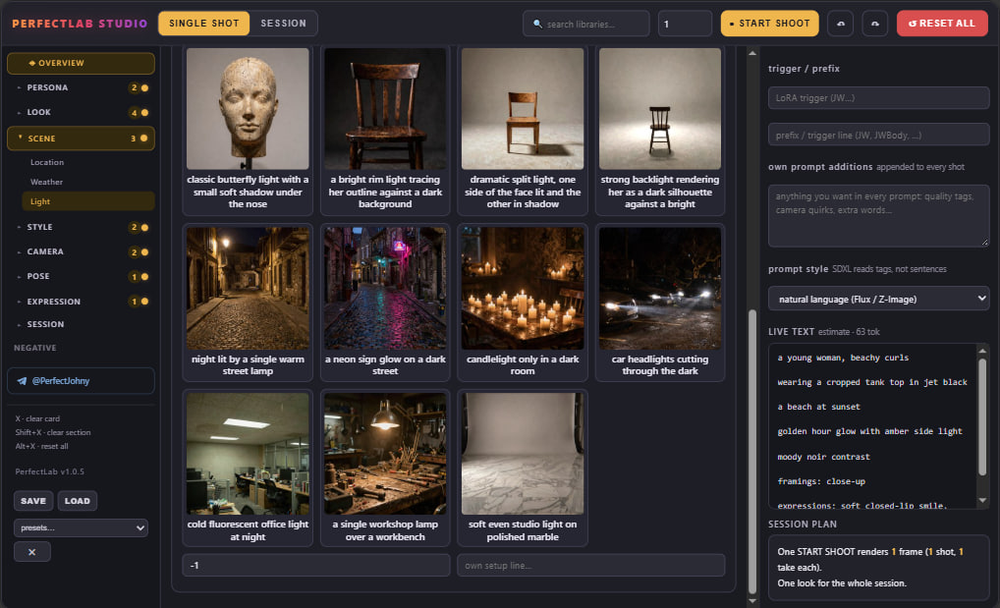</p>

### Weather

10 conditions, each an empty landscape.

<p align="center"></p>

## 🎞 Style

16 color grades, 10 film stocks, and a palette of up to 5 swatches with a modifier (neon, pastel, matte, metallic, earthy).

<p align="center">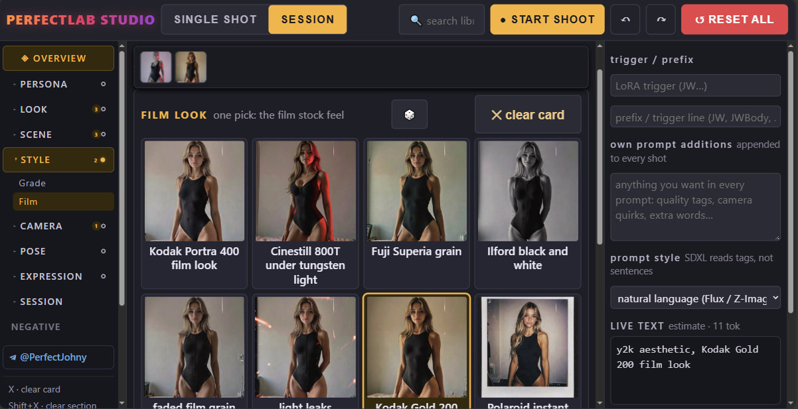</p>

## 📷 Camera

### Framing

12 crops: seven classic (extreme close-up to wide) plus five angles (profile, over-the-shoulder, low, high, dutch). Multi-pick: the session walks them in order.

<p align="center">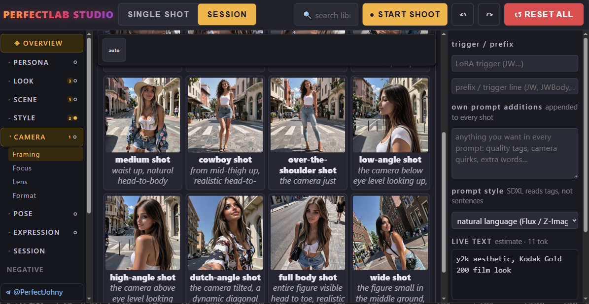</p>

### Other camera fields

- **Focus** — 12 attention points (face, eyes, outfit, hands, full figure, silhouette, background, hair, shoes, jewelry, profile, lips)
- **Lens** — 5 focal lengths: 85mm portrait, 50mm natural, 35mm street, 24mm wide, macro detail
- **Format** — pinned aspect ratios (1:1, 4:5, 3:4, 2:3, 9:16, 3:2, 16:9) or follows the framing

## 🚶 Pose

36 poses as a walk. Each tile shows the pose in full body.

<p align="center">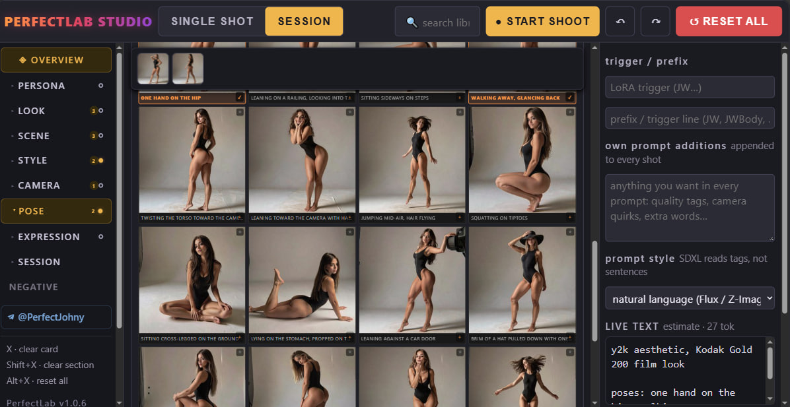</p>

## 😊 Expression

28 expressions as a walk: the picked set rotates across the session, one per shot.

<p align="center">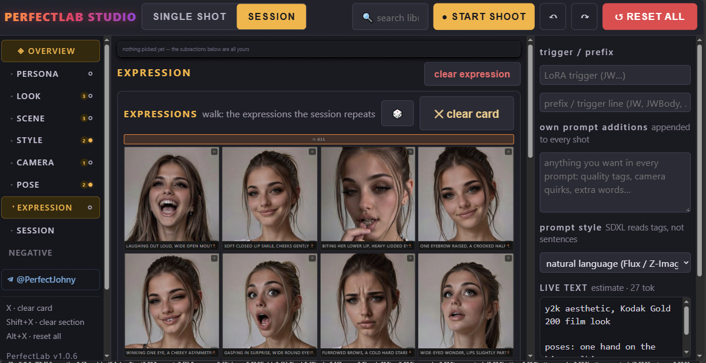</p>

## 🔍 Search

Type a word in the header search box. Matching picks from all libraries appear with their thumbnails. Click a result to pick it.

## ✍️ Text tools

Any own-line and the custom field understand:

- **`{a|b|c}`** — an inline choice. Every shot picks one alternative from its own seed; nested braces resolve inside-out.
- **`__filename__`** — a wildcard file. Pulls a line from `web/wildcards/filename.txt` (one phrase per line, `#` comments skip, re-reads when the file changes). Two starters ship: `__mood__`, `__time_of_day__`.

## ⚠️ Linter

The ⚠ badge in the header counts problems in the composed prompt: token overflow (400 = the Z-Image budget), duplicates, unbalanced braces, choices without a `|`, missing wildcard files, an empty negative. Click for the list.

## 📤 Outputs

`PROMPT · NEGATIVE · WIDTH · HEIGHT · SEED · META` — all lists:

- `PROMPT` → CLIP Text Encode (positive)
- `NEGATIVE` → CLIP Text Encode (negative)
- `WIDTH` / `HEIGHT` → Empty Latent Image
- `SEED` → KSampler seed
- `META` → a JSON recipe per shot (framing tier, seed, takes)

## ⌨️ Hotkeys

| Key | Action |
| --- | --- |
| **Ctrl+Z** / **Ctrl+Shift+Z** / **Ctrl+Y** | undo / redo a pick |
| **X** | clear the active card |
| **Shift+X** | clear the whole section |
| **Alt+X** | reset everything |

## 📦 Install

1. **ComfyUI Manager** (recommended). Search for `PerfectLab`, install, restart ComfyUI.
2. **ComfyUI Registry.**
   [perfectlab on registry.comfy.org](https://registry.comfy.org/publishers/perfectmodelslab/nodes/comfyui-perfectlab).
3. **Manual.**
   ```
   git clone https://github.com/perfectmodelslab/ComfyUI-PerfectLab.git ComfyUI/custom_nodes/PerfectLab
   ```
   Then restart ComfyUI.

No Python dependencies. Works with any text-to-image model: SDXL, Flux, Z-Image and others.

## 🔧 Troubleshooting

| Problem | Fix |
|---|---|
| The panel did not appear after install or update | Hard refresh the browser (Ctrl+F5). |
| The node is missing from the menu | Restart ComfyUI. |
| Preview tiles do not load | Check that `web/guide/items/` exists in the node folder. |
| The prompt comes out empty | Pick at least one thing in PERSONA or LOOK. |
| Wrong text mode for your model | Switch NATURAL / TAGS in the right column. |
| Custom entries do not survive a reload | PerfectLab ships its own write endpoint as a fallback. |

## 📖 Full manual

Every section documented card by card, with the complete tile library walls: [docs/sections/sections.md](docs/sections/sections.md).

## 📄 License

MIT, see [LICENSE](LICENSE). Author and support: [@PerfectJohny](https://t.me/PerfectJohny).
